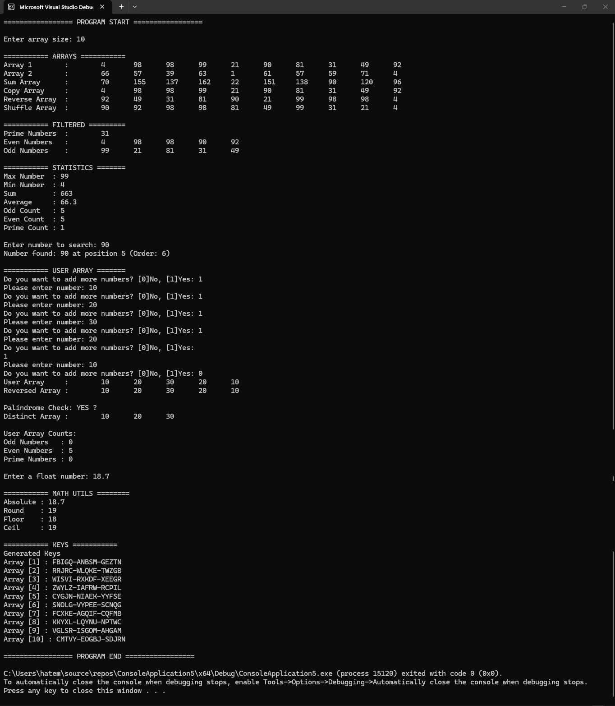

# C++ Array Utilities

Welcome to **C++ Array Utilities**, a comprehensive and beginner-friendly C++ project that provides a set of utilities for creating, analyzing, and manipulating arrays. This tool is ideal for learning, experimenting with arrays, and understanding array-based algorithms.

---

## 📦 Features

* 🚀 **Random Array Creation:** Generate arrays with random numbers.
* 🔁 **Array Manipulation:** Copy, reverse, shuffle, and sum arrays element-wise.
* 📊 **Array Analysis:** Calculate max, min, sum, average, and extract even/odd/prime values.
* 🔍 **Filtering & Searching:** Filter prime, even, odd values; search for specific numbers.
* ✍️ **Dynamic Input:** Add numbers interactively to arrays.
* 🔢 **Math Utilities:** Compute Power, absolute, round, floor, and ceil of floating-point numbers.
* 🔑 **Key Generation:** Generate random alphanumeric keys in structured blocks.

---

## Example Output 

> ⚠️ Note: Output will vary depending on random number generation.

---

## 🛠️ How to Compile & Run

### 📌 Compile

Use a C++ compiler (e.g., `g++`) to build the project:

```bash
g++ src/*.cpp -o ArrayUtilities
```

### ▶️ Run

Execute the program:

```bash
./ArrayUtilities
```

Follow the interactive prompts to use all utilities.

---

## 💾 Project Structure

```
CppArrayUtilities/
├─ include/                # Header files (.h)
│   └─ ArrayUtilities.h
├─ src/                    # Implementation files (.cpp)
│   ├─ main.cpp
│   └─ ArrayUtilities.cpp
├─ README.md               # This documentation
└─ output.png              # Optional screenshot of output
```

---

## 🤠 Why This Project?

This project is useful for:

* 👶 **Beginners:** Practice array operations and fundamental C++ concepts.
* 🎓 **Students:** Understand dynamic memory, pointers, loops, and functions.
* 💻 **Developers:** Reuse utility functions in larger C++ applications.

---

## 🗑️ License

This project is open-source and available for free use, modification, and learning purposes.
